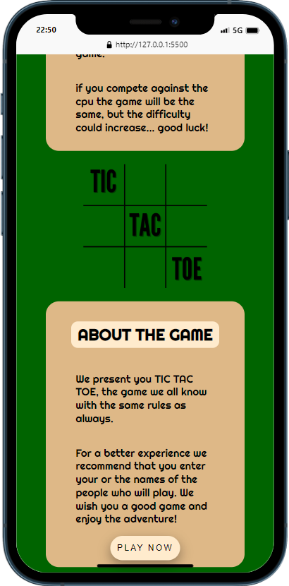

# Tic Tac Toe 🎮

## About the project 🔍

I designed this tic tac toe as a project of GeeksHubs Academy, it is based on three pages: the main page, the part to select the mode, the game, and the final part that shows the winner.

## Getting Started 💻

You can enter the website and see everything on your own. [Enter here.](https://nicolaslanusse.github.io/TicTacToe/)

## Built with ⚒️

  

## Preview 👀

Here you can see some screenshots of what the project is about

</img>
